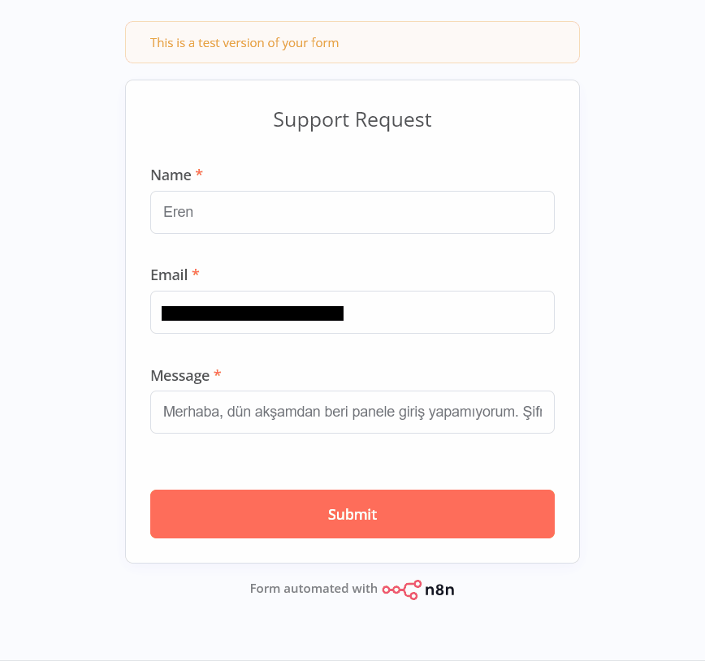
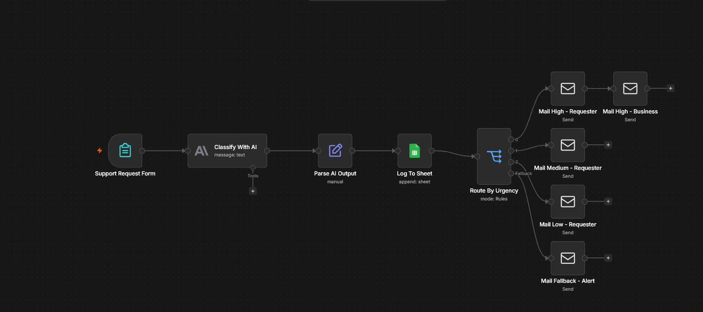
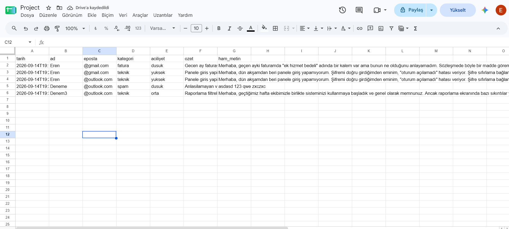

# AI Support Request Triage (n8n)

An n8n workflow that turns an incoming support request into a classified, summarised and routed ticket — without anyone reading it first.

A customer submits a form. Claude classifies the request by category and urgency and writes a one-sentence summary. Every request is logged to Google Sheets, and the reply that goes out depends on how urgent the request is: high-urgency cases also alert the business immediately.



---

## What it does

- **Collects requests** through a hosted form — no website or extra infrastructure required
- **Classifies** each request into one of four categories (`fatura`, `teknik`, `genel`, `spam`) and three urgency levels (`dusuk`, `orta`, `yuksek`)
- **Summarises** the request in a single sentence for fast scanning
- **Logs everything** to Google Sheets, including the raw message, so any classification can be audited afterwards
- **Routes the response**: urgent requests trigger both a customer acknowledgement and an internal alert; anything the classifier does not recognise goes to a fallback branch that notifies the operator instead of being dropped silently

## How it works



| Node | Type | Role |
| --- | --- | --- |
| `Support Request Form` | Form Trigger | Hosted form with three required fields |
| `Classify With AI` | Anthropic | Classifies and summarises; returns a single JSON object |
| `Parse AI Output` | Edit Fields | Parses the model's JSON string into usable fields |
| `Log To Sheet` | Google Sheets | Appends one row per request |
| `Route By Urgency` | Switch | Routes on urgency, with a fallback output |
| `Mail High - Requester` | Send Email | Acknowledgement for urgent requests |
| `Mail High - Business` | Send Email | Internal alert with the full request text |
| `Mail Medium - Requester` | Send Email | Standard acknowledgement |
| `Mail Low - Requester` | Send Email | Standard acknowledgement |
| `Mail Fallback - Alert` | Send Email | Operator alert for unrecognised values |

### Routing

| Urgency | Customer email | Internal alert |
| --- | --- | --- |
| `yuksek` | Yes — flagged as prioritised | Yes |
| `orta` | Yes — standard | No |
| `dusuk` | Yes — standard | No |
| anything else | No | Yes — operator alert |

### Data model

**Form fields:** `Name`, `Email` (email type), `Message` — all required.

**Classifier output schema:**

```json
{
  "kategori": "fatura | teknik | genel | spam",
  "aciliyet": "dusuk | orta | yuksek",
  "ozet": "string",
  "guven": "dusuk | orta | yuksek"
}
```

**Sheet columns:** `tarih`, `ad`, `eposta`, `kategori`, `aciliyet`, `ozet`, `ham_metin`



The prompt pins the allowed values explicitly. Free-form urgency labels would silently miss the Switch conditions and fall through to the fallback branch, so the value set is treated as a contract between the model and the workflow. The prompt also instructs the model to treat the incoming message as data rather than instructions, and to classify prompt-injection attempts as `spam`.

`ham_metin` stores the original message alongside the classification. Without it there is no way to review a disputed classification or to improve the prompt from real traffic.

## Setup

**Requirements**

- A running n8n instance
- An Anthropic API key
- A Google account with the Sheets API and Drive API enabled
- An SMTP account (an app password, if the provider requires one)

**Steps**

1. Create a Google Sheet and add the seven column headers listed above to the first row.
2. Import `workflow.json` into n8n.
3. Create three credentials and attach them to the relevant nodes: Anthropic, Google Sheets (OAuth2), and SMTP.
4. In `Log To Sheet`, select your own document and sheet — the exported file ships with a placeholder ID.
5. In every email node, replace the placeholder `From` address, and set the `To` address on `Mail High - Business` and `Mail Fallback - Alert` to the operator's inbox.
6. Publish the workflow and open the form's production URL.

The exported workflow contains no credentials; all secrets are referenced by name and must be recreated in the target instance.

## Testing

The workflow was verified against the following scenarios:

| # | Scenario | Expected result |
| --- | --- | --- |
| 1 | Routine billing question | Correct category, single acknowledgement, row logged |
| 2 | Urgent technical issue with a deadline | `yuksek`, two emails sent |
| 3 | Nonsense input | Classified as spam, flow does not break |
| 4 | Long message with Turkish characters | Summary stays to one sentence, characters intact in Sheets |
| 5 | Missing required field | Submission blocked, flow not triggered |
| 6 | Invalid API credential | Execution fails loudly and the error workflow sends an alert |

A separate error workflow is attached in the workflow settings, so a failure at any node produces a notification rather than a silently lost request.

## Known limitations

- Runs locally; a production deployment needs a hosted n8n instance so the form URL stays reachable and the schedule keeps running.
- Requests routed to the fallback branch alert the operator but receive no automatic acknowledgement — intentional, so a human decides what to send.
- Form validation is browser-side only. A request posted directly to the webhook bypasses it; a server-side check belongs in the flow before production use.
- The classifier returns a `guven` (confidence) field that is currently unused. Routing low-confidence results to human review is the natural next step.
- Consumer SMTP providers impose daily sending limits and are not suitable for production volume.

